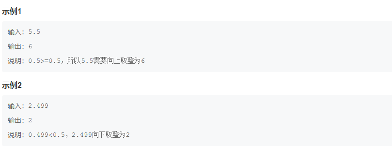
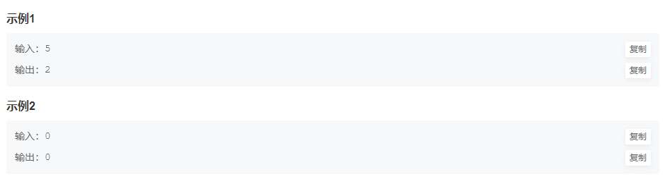
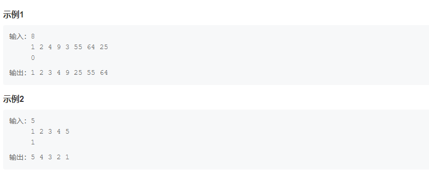

HJ7 取近似值
描述:
    写出一个程序，接受一个正浮点数值，输出该数值的近似整数值。如果小数点后数值大于等于 0.5 ,向上取整；小于 0.5 ，则向下取整。
数据范围：
    保证输入的数字在 32 位浮点数范围内
输入描述：
    输入一个正浮点数值
输出描述：
    输出该数值的近似整数值

************************************************************************************************************************
HJ15 求int型正整数在内存中存储时1的个数
描述:
    输入一个 int 型的正整数，计算出该 int 型数据在内存中存储时 1 的个数。
数据范围：
    保证在 32 位整型数字范围内
输入描述：
    输入一个整数（int类型）
输出描述：
    这个数转换成2进制后，输出1的个数

************************************************************************************************************************
HJ101 输入整型数组和排序标识，对其元素按照升序或降序进行排序
描述:
    输入整型数组和排序标识，对其元素按照升序或降序进行排序

数据范围：
    1 <= n <= 1000，元素大小满足 0 <= value <= 100000
输入描述：
    第一行输入数组元素个数
    第二行输入待排序的数组，每个数用空格隔开
    第三行输入一个整数0或1。0代表升序排序，1代表降序排序
输出描述：
    输出排好序的数字
