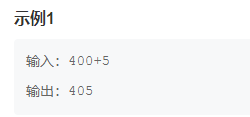
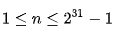
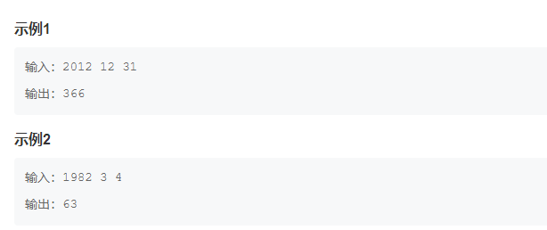
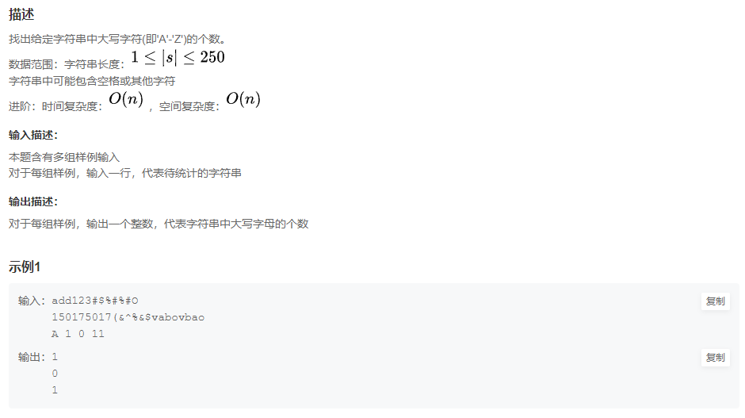

HJ11 数字颠倒
描述:
    输入一个整数，将这个整数以字符串的形式逆序输出
    程序不考虑负数的情况，若数字含有0，则逆序形式也含有0，如输入为100，则输出为001
数据范围：
输入描述：
    输入一个int整数
输出描述：
    将这个整数以字符串的形式逆序输出

************************************************************************************************************************
HJ12 字符串反转
描述:
接受一个只包含小写字母的字符串，然后输出该字符串反转后的字符串。（字符串长度不超过1000）
输入描述：
    输入一行，为一个只包含小写字母的字符串。
输出描述：
    输出该字符串反转后的字符串。

************************************************************************************************************************
HJ22 汽水瓶
描述
    有这样一道智力题：“某商店规定：三个空汽水瓶可以换一瓶汽水。小张手上有十个空汽水瓶，她最多可以换多少瓶汽水喝？”答案是 5 瓶，方法如下：
先用 9 个空瓶子换3瓶汽水，喝掉 3 瓶满的，喝完以后 4 个空瓶子，用 3 个再换一瓶，喝掉这瓶满的，这时候剩 2 个空瓶子。然后你让老板先借给你一瓶汽水，
喝掉这瓶满的，喝完以后用 3 个空瓶子换一瓶满的还给老板。如果小张手上有 n 个空汽水瓶，最多可以换多少瓶汽水喝？
数据范围：
    输入的正整数满足 1 <= n <= 100
注意：本题存在多组输入。
    允许如题面所述向老板借汽水。
    输入的 0 仅表示输入结束，并不用输出结果
输入描述：
输入文件最多包含 10 组测试数据，每个数据占一行，仅包含一个正整数 n（ 1<=n<=100 ），表示小张手上的空汽水瓶数。n=0 表示输入结束，你的程序不应当处理这一行。
输出描述：
对于每组测试数据，输出一行，表示最多可以喝的汽水瓶数。如果一瓶也喝不到，输出0。

************************************************************************************************************************
HJ31 单词倒排
描述:
    对字符串中的所有单词进行倒排。
说明：
    1、构成单词的字符只有26个大写或小写英文字母；
    2、非构成单词的字符均视为单词间隔符；
    3、要求倒排后的单词间隔符以一个空格表示；如果原字符串中相邻单词间有多个间隔符时，倒排转换后也只允许出现一个空格间隔符；
    4、每个单词最长20个字母；
数据范围：字符串长度满足 
输入描述：
    输入一行以空格来分隔的句子
输出描述：
    输出句子的逆序

************************************************************************************************************************
HJ37 统计每个月兔子的总数
描述:
    有一只兔子，从出生后第3个月起每个月都生一只兔子，小兔子长到第三个月后每个月又生一只兔子，假如兔子都不死，问第n个月的兔子总数为多少？
本题有多组数据。
数据范围：每组输入满足 
输入描述：
    多行输入，一行输入一个int型整数表示第n个月
输出描述：
    每一行输出对应的兔子总数

************************************************************************************************************************
HJ50 四则运算 
参考： https://zhuanlan.zhihu.com/p/87053126
描述:
    输入一个表达式（用字符串表示），求这个表达式的值。
    保证字符串中的有效字符包括[‘0’-‘9’],‘+’,‘-’, ‘*’,‘/’ ,‘(’， ‘)’,‘[’, ‘]’,‘{’ ,‘}’。且表达式一定合法。
数据范围：表达式计算结果和过程中满足 |value| <= 1000 ，字符串长度满足 1 <= n <= 1000
输入描述：
    输入一个算术表达式
输出描述：
    得到计算结果

************************************************************************************************************************
HJ53 杨辉三角的变形
描述:
    
    以上三角形的数阵，第一行只有一个数1，以下每行的每个数，是恰好是它上面的数，左上角数到右上角的数，3个数之和（如果不存在某个数，认为该数就是0）。
    求第n行第一个偶数出现的位置。如果没有偶数，则输出-1。例如输入3,则输出2，输入4则输出3。
数据范围： 
本题有多组输入数据
输入描述：
    输入一个int整数
输出描述：
    输出返回的int值

************************************************************************************************************************
HJ54 表达式求值
描述
    给定一个字符串描述的算术表达式，计算出结果值。
    输入字符串长度不超过 100 ，合法的字符包括 ”+, -, *, /, (, )” ， ”0-9” 。
数据范围：运算过程中和最终结果均满足  ，即只进行整型运算，确保输入的表达式合法
输入描述：
    输入算术表达式
输出描述：
    计算出结果值

************************************************************************************************************************
HJ56 完全数计算
描述
    完全数（Perfect number），又称完美数或完备数，是一些特殊的自然数。
    它所有的真因子（即除了自身以外的约数）的和（即因子函数），恰好等于它本身。
    例如：28，它有约数1、2、4、7、14、28，除去它本身28外，其余5个数相加，1+2+4+7+14=28。
    输入n，请输出n以内(含n)完全数的个数。
数据范围:

本题输入含有多组样例。
输入描述：
    输入一个数字n
输出描述：
    输出不超过n的完全数的个数

************************************************************************************************************************
HJ61 放苹果
描述
    把m个同样的苹果放在n个同样的盘子里，允许有的盘子空着不放，问共有多少种不同的分法？（用K表示）5，1，1和1，5，1 是同一种分法。
数据范围： 0<=m<=10, 1<=n<=10
本题含有多组样例输入。
输入描述：
    输入两个int整数
输出描述：
    输出结果，int型

************************************************************************************************************************
HJ62 查找输入整数二进制中1的个数 (与HJ15类似)
描述
    输入一个正整数，计算它在二进制下的1的个数。
注意多组输入输出！！！！！！
数据范围：
输入描述：
    输入一个整数
输出描述：
    计算整数二进制中1的个数

************************************************************************************************************************
HJ66 配置文件恢复
描述
    有6条配置命令，它们执行的结果分别是：

注意：he he不是命令。
为了简化输入，方便用户，以“最短唯一匹配原则”匹配：
    1、若只输入一字串，则只匹配一个关键字的命令行。例如输入：r，根据该规则，匹配命令reset，执行结果为：reset what；输入：res，根据该规则，匹配命令reset，执行结果为：reset what；
    2、若只输入一字串，但匹配命令有两个关键字，则匹配失败。例如输入：reb，可以找到命令reboot backpalne，但是该命令有两个关键词，所有匹配失败，执行结果为：unknown command
    3、若输入两字串，则先匹配第一关键字，如果有匹配，继续匹配第二关键字，如果仍不唯一，匹配失败。
    例如输入：r b，找到匹配命令reset board 和 reboot backplane，执行结果为：unknown command。
    例如输入：b a，无法确定是命令board add还是backplane abort，匹配失败。
    4、若输入两字串，则先匹配第一关键字，如果有匹配，继续匹配第二关键字，如果唯一，匹配成功。例如输入：bo a，确定是命令board add，匹配成功。
    5、若输入两字串，第一关键字匹配成功，则匹配第二关键字，若无匹配，失败。例如输入：b addr，无法匹配到相应的命令，所以执行结果为：unknow command。
    6、若匹配失败，打印“unknown command”
注意：有多组输入。
数据范围：数据组数：1<=t<=800，字符串长度1<=s<=20
进阶：时间复杂度：，空间复杂度：
输入描述：
    多行字符串，每行字符串一条命令
输出描述：
    执行结果，每条命令输出一行

************************************************************************************************************************
HJ72 百钱买百鸡问题
描述
    公元前五世纪，我国古代数学家张丘建在《算经》一书中提出了“百鸡问题”：鸡翁一值钱五，鸡母一值钱三，鸡雏三值钱一。百钱买百鸡，问鸡翁、鸡母、鸡雏各几何？
    现要求你打印出所有花一百元买一百只鸡的方式。
输入描述：
    输入任何一个整数，即可运行程序。
输出描述：
    输出有数行，每行三个整数，分别代表鸡翁，母鸡，鸡雏的数量

************************************************************************************************************************
HJ73 计算日期到天数转换
描述
    根据输入的日期，计算是这一年的第几天。
    保证年份为4位数且日期合法。

输入描述：
    输入一行，每行空格分割，分别是年，月，日
输出描述：
    输出是这一年的第几天

************************************************************************************************************************
HJ74 参数解析
描述
    在命令行输入如下命令：
    xcopy /s c:\\ d:\\e，
    各个参数如下：
    参数1：命令字xcopy
    参数2：字符串/s
    参数3：字符串c:\\
    参数4: 字符串d:\\e
    请编写一个参数解析程序，实现将命令行各个参数解析出来。
解析规则：
    1.参数分隔符为空格
    2.对于用""包含起来的参数，如果中间有空格，不能解析为多个参数。比如在命令行输入xcopy /s "C:\\program files" "d:\"时，参数仍然是4个，第3个参数应该是字符串C:\\program files，而不是C:\\program，注意输出参数时，需要将""去掉，引号不存在嵌套情况。
    3.参数不定长
    4.输入由用例保证，不会出现不符合要求的输入
数据范围：字符串长度 1<=s<=1000
进阶：时间复杂度：O(n)，空间复杂度：O(n)
输入描述：
    输入一行字符串，可以有空格
输出描述：
    输出参数个数，分解后的参数，每个参数都独占一行

************************************************************************************************************************
HJ75 公共子串计算
描述
    给定两个只包含小写字母的字符串，计算两个字符串的最大公共子串的长度。
注：子串的定义指一个字符串删掉其部分前缀和后缀（也可以不删）后形成的字符串。
数据范围：字符串长度：
进阶：时间复杂度：，空间复杂度：
输入描述：
    输入两个只包含小写字母的字符串
输出描述：
    输出一个整数，代表最大公共子串的长度
************************************************************************************************************************
HJ76 尼科彻斯定理
描述
    验证尼科彻斯定理，即：任何一个整数m的立方都可以写成m个连续奇数之和。
例如：
    1^3=1
    2^3=3+5
    3^3=7+9+11
    4^3=13+15+17+19

输入一个正整数m（m≤100），将m的立方写成m个连续奇数之和的形式输出。
本题含有多组输入数据。
数据范围：数据组数：1<=t<=5 1<=m<=100，
进阶：时间复杂度：O(1)，空间复杂度：O(1)
输入描述：
    输入一个int整数
输出描述：
    输出分解后的string

************************************************************************************************************************
HJ83 二维数组操作

************************************************************************************************************************
HJ84 统计大写字母个数

************************************************************************************************************************
HJ85 最长回文子串

************************************************************************************************************************
HJ86 求最大连续bit数

************************************************************************************************************************
************************************************************************************************************************
************************************************************************************************************************
************************************************************************************************************************
************************************************************************************************************************
************************************************************************************************************************
************************************************************************************************************************
************************************************************************************************************************
************************************************************************************************************************
************************************************************************************************************************
************************************************************************************************************************
************************************************************************************************************************
************************************************************************************************************************
************************************************************************************************************************
************************************************************************************************************************

