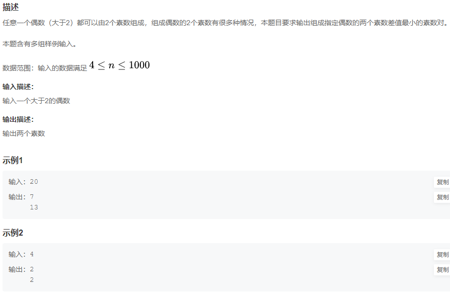
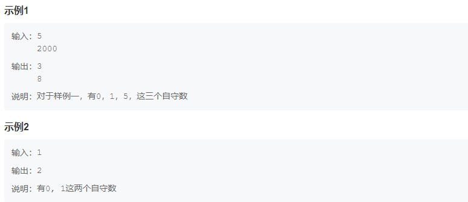

HJ1 字符串最后一个单词的长度

************************************************************************************************************************
HJ5 进制转换

************************************************************************************************************************
HJ6 质数因子

************************************************************************************************************************
HJ8 合并表记录

************************************************************************************************************************
HJ9 提取不重复的整数

************************************************************************************************************************
HJ10 字符个数统计

************************************************************************************************************************
HJ14 字符串排序

************************************************************************************************************************
HJ16 购物单

************************************************************************************************************************
HJ21 简单密码

************************************************************************************************************************
HJ26 字符串排序

************************************************************************************************************************
HJ34 图片整理

************************************************************************************************************************
HJ36 字符串加密

************************************************************************************************************************
HJ38 求小球落地5次后所经历的路程和第5次反弹的高度

************************************************************************************************************************
HJ40 统计字符

************************************************************************************************************************
HJ43 迷宫问题

************************************************************************************************************************
HJ45 名字的漂亮度

************************************************************************************************************************
HJ46 截取字符串

************************************************************************************************************************
HJ48 从单向链表中删除指定值的节点

************************************************************************************************************************
HJ52 计算字符串的距离
参考： https://www.jianshu.com/p/9a53f32cf62b

************************************************************************************************************************
HJ55 挑7

************************************************************************************************************************
HJ57 高精度整数加法

参考: https://blog.51cto.com/u_15273875/3658191
     https://python.iitter.com/other/150005.html
************************************************************************************************************************
HJ59 找出字符串中第一个只出现一次的字符

************************************************************************************************************************
HJ60 查找组成一个偶数最接近的两个素数

求素数参考：https://www.runoob.com/python/python-get-prime-number.html
************************************************************************************************************************
HJ63 DNA序列

参考： https://www.cnblogs.com/xxpythonxx/p/12181224.html (list 元素顺序不变去重)
************************************************************************************************************************
HJ64 MP3光标位置

************************************************************************************************************************
HJ65 查找两个字符串a,b中的最长公共子串

************************************************************************************************************************
HJ67 24点游戏算法

************************************************************************************************************************
HJ69 矩阵乘法

************************************************************************************************************************
HJ70 矩阵乘法计算量估算

************************************************************************************************************************
HJ71 字符串通配符

************************************************************************************************************************
HJ88 扑克牌大小

************************************************************************************************************************
HJ90 合法IP

************************************************************************************************************************
HJ96 表示数字

************************************************************************************************************************
HJ98 自动售货系统
具体链接：https://www.nowcoder.com/practice/cd82dc8a4727404ca5d32fcb487c50bf?tpId=37&&tqId=21321&rp=1&ru=/ta/huawei&qru=/ta/huawei/question-ranking
************************************************************************************************************************
HJ99 自守数

************************************************************************************************************************
HJ102 字符统计
参考： https://blog.nowcoder.net/n/7bd5ce2e567b459e8fbdac85c9552f8a
      https://ksou.cc/w/jwa/129196137.html

************************************************************************************************************************
HJ103 Redraiment的走法

************************************************************************************************************************
HJ107 求解立方根
